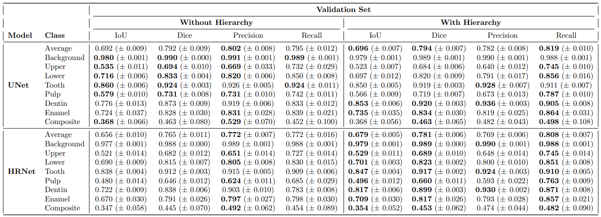
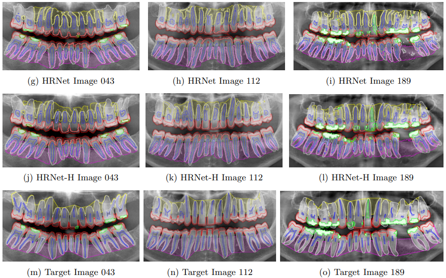

# Restrictive Hierarchical Semantic Segmentation for Stratified Tooth Layer Detection


Authors: Ryan Banks, Camila Lindoni, Lilian Tang, Yunpeng Li


## Overview

### Abstract

Accurate understanding of anatomical structures is essential for reliably staging certain dental diseases. A way of introducing this within semantic segmentation models is by utilising hierarchy-aware methodologies. However, existing hierarchy-aware segmentation methods largely encode anatomical structure through the loss functions, providing weak and indirect supervision. We introduce a general framework that embeds an explicit anatomical hierarchy into semantic segmentation by coupling a recurrent, level-wise prediction scheme with restrictive output heads and top-down feature conditioning. At each depth of the class tree, the backbone is re-run on the original image concatenated with logits from the previous level. Child class features are conditioned using Feature-wise Linear Modulation of their parent class probabilities, to modulate child feature spaces for fine grained detection. A probabilistic composition rule enforces consistency between parent and descendant classes. Hierarchical loss combines per-level class weighted Dice and cross entropy loss and a consistency term loss, ensuring parent predictions are the sum of their children. We validate our approach on our proposed dataset, TL-pano, containing 194 panoramic radiographs with dense instance and semantic segmentation annotations, of tooth layers and alveolar bone. Utilising UNet and HRNet as donor models across a 5-fold cross validation scheme, the hierarchical variants consistently increase IoU, Dice, and recall, particularly for fine-grained anatomies, and produce more anatomically coherent masks. However, hierarchical variants also demonstrated increased recall over precision, implying increased false positives. The results demonstrate that explicit hierarchical structuring improves both performance and clinical plausibility, especially in low data dental imaging regimes.


### Quantitative Results

<p align="center">
	 <br />
	<em>
		Figure 1: Per-class semantic segmentation metrics mean (± standard deviation), comparing Original and Hierarchical versions of UNet and HRNet on the validation set. Bold values are better performing when comparing original and hierarchical versions.
	</em>
</p>


### Qualitative Results

<p align="center">
	 <br />
	<em>
		 Figure 2: Figure containing images with overlaid predictions and targets, for each model. Classes include: Upper Alveolar Bone (yellow), Lower Alveolar Bone (pink), Pulp (dark blue), Dentin (white), Enamel (red) and Composite (green).
	</em>
</p>


## Usage

### Preparation


+ Clone the repository and navigate to new directory:

```
git clone https://github.com/Banksylel/Restrictive-Hierarchical-Code
cd ./Restrictive-Hierarchical-Code
```

+ Install the requirements:

```
pip install -r requirements.txt
```

+ Install the latest version of pytorch:

[Pytorch](https://pytorch.org/get-started/locally/)

+ Download the [Trained_Weights]() 

+ Download the [Pretrained_weights](https://drive.google.com/file/d/1Iik0cRxxHq25ufOztsesryXQnzaU0rbg/view?usp=drive_link](https://drive.google.com/file/d/1Iik0cRxxHq25ufOztsesryXQnzaU0rbg/view?usp=sharing)


### Train

Train HRNet donor model with Hierarchy:

```
python train.py --save-path=="[FULL PATH TO FOLDER]/Trained models/runs/[EXPERIMENT NAME]" --data-root="[FULL PATH TO DATA]/semantic/5_fold" --tree-root="[FULL PATH TO FOLDER]/class_tree_tl.json" --class-map="[FULL PATH TO FOLDER]/class_map.csv" --model-weights="[FULL PATH TO FOLDER]/hrnet_cocostuff_3617_torch04.pth" --config="[FULL PATH TO FOLDER]/config/seg_hrnet_w48_520x520_ohem_sgd_lr1e-3_wd1e-4_bs_16_epoch110.yaml" --batch-size="4" --val-batch="4" --img-size="620" --test-remove="True" --epochs="80" --num-workers="0" --save-images-batch="True" --save-images-batch-num="5" --no-ph-weights="True" --learning-rate="0.024" --learning-rate-scheduler-minimum="0.001" --level-weights="[[0.0297, 1.577, 0.9619, 0.1770],[1.5432, 0.2638, 1.0413, 3.9722]]" --model-type="1" --model-select="1" --inc-cross-val="True" --folds="5"
```


Train HRNet donor model without Hierarchy:

```
python train.py --save-path=="[FULL PATH TO FOLDER]/Trained models/runs/[EXPERIMENT NAME]" --data-root="[FULL PATH TO DATA]/semantic/5_fold" --tree-root="[FULL PATH TO FOLDER]/class_tree_tl.json" --class-map="[FULL PATH TO FOLDER]/class_map.csv" --model-weights="[FULL PATH TO FOLDER]/hrnet_cocostuff_3617_torch04.pth" --config="[FULL PATH TO FOLDER]/config/seg_hrnet_w48_520x520_ohem_sgd_lr1e-3_wd1e-4_bs_16_epoch110.yaml" --batch-size="4" --val-batch="4" --img-size="620" --test-remove="True" --epochs="80" --num-workers="0" --save-images-batch="True" --save-images-batch-num="5" --no-ph-weights="True" --learning-rate="0.022" --learning-rate-scheduler-minimum="0.001" --level-weights="[[0.0285, 1.5159, 0.9227, 1.4842, 0.2532, 1.0, 3.8021]]" --model-type="0" --model-select="1" --inc-cross-val="True" --folds="5"
```

Train UNet donor model with Hierarchy:

```
python train.py --save-path=="[FULL PATH TO FOLDER]/Trained models/runs/[EXPERIMENT NAME]" --data-root="[FULL PATH TO DATA]/semantic/5_fold" --tree-root="[FULL PATH TO FOLDER]/class_tree_tl.json" --class-map="[FULL PATH TO FOLDER]/class_map.csv" --model-weights="[FULL PATH TO FOLDER]/unet_carvana_scale1.0_epoch2.pth" --batch-size="4" --val-batch="4" --img-size="620" --test-remove="True" --epochs="80" --num-workers="0" --save-images-batch="True" --save-images-batch-num="5" --no-ph-weights="True" --learning-rate="0.022" --learning-rate-scheduler-minimum="0.001" --level-weights="[[0.0297, 1.577, 0.9619, 0.1770],[1.5432, 0.2638, 1.0413, 3.9722]]" --model-type="1" --model-select="0" --inc-cross-val="True" --folds="5"
```

Train UNet donor model without Hierarchy:

```
python train.py --save-path=="[FULL PATH TO FOLDER]/Trained models/runs/[EXPERIMENT NAME]" --data-root="[FULL PATH TO DATA]/semantic/5_fold" --tree-root="[FULL PATH TO FOLDER]/class_tree_tl.json" --class-map="[FULL PATH TO FOLDER]/class_map.csv" --model-weights="[FULL PATH TO FOLDER]/unet_carvana_scale1.0_epoch2.pth" --batch-size="4" --val-batch="4" --img-size="620" --test-remove="True" --epochs="80" --num-workers="0" --save-images-batch="True" --save-images-batch-num="5" --no-ph-weights="True" --learning-rate="0.018" --learning-rate-scheduler-minimum="0.001" --level-weights="[[0.0285, 1.5159, 0.9227, 1.4842, 0.2532, 1.0, 3.8021]]" --model-type="0" --model-select="0" --inc-cross-val="True" --folds="5"
```


+ Replace `[FULL PATH TO FOLDER]` with the full file path to the repo on your device.

+ Replace `[EXPERIMENT NAME]` with the name of your experiment.

+ Replace `[FULL PATH TO DATA]` with the full file path to the dataset on your device. e.g. "C:/user/Dataset/train"

+ tree-root can link to the original hierarchy file and extended hierarchy


### Prediction and Evaluation

Predict and evaluate on the val split of a dataset:


```
python predictEval.py --save-loc="[EXPERIMENT NAME]" --full-ds="[FULL PATH TO DATA]/semantic/5_fold" --tree-root="[FULL PATH TO FOLDER]/class_tree_tl.json" --class-map="[FULL PATH TO FOLDER]/class_map.csv" --model-weights="[FULL PATH TO FOLDER]/runs/[PREVIOUS EXPERIMENT NAME]" --config="[FULL PATH TO FOLDER]/config/seg_hrnet_w48_520x520_ohem_sgd_lr1e-3_wd1e-4_bs_16_epoch110.yaml" --img-size="620" --num-workers="0" --save-images="True" --include-background="True" --include-std-div="True" --model-type="0" --model-select="0" --inc-cross-val="True" --folds="5"
```

+ Replace `[FULL PATH TO FOLDER]` with the full file path to the repo on your device.

+ Replace `[EXPERIMENT NAME]` with the name of your experiment for evaluation.

+ Replace `[PREVIOUS EXPERIMENT NAME]` with the name of the previous experiment weight folder

+ Replace `[FULL PATH TO DATA]` with the full file path to the dataset on your device. e.g. "C:/user/Dataset/val"

